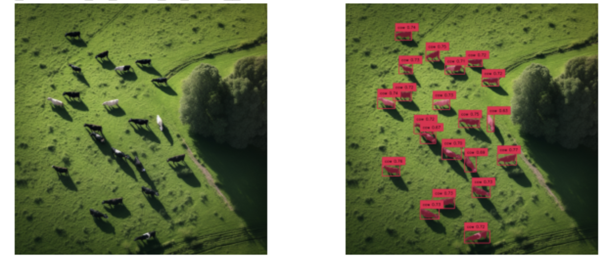

# Midjourney, Grounding Dino and SAM:    Prompt-based image dataset generation and annotation 
### Accompanying Medium article

 

This notebook is based on the brilliant work on this topic from [Roboflow](https://blog.roboflow.com/enhance-image-annotation-with-grounding-dino-and-sam/), you can find their original notebook on using Grounding DINO with SAM [here](https://colab.research.google.com/drive/1IwrFy7vbkFxsnjJFv4DExPQWkBNFve80#scrollTo=Ll-F98Z7YItp:~:text=DINO%20with%20SAM-,here,-.).

Extra steps I am adding:

* Download my Midjourney-generated images of cows from my Google Drive link as a zip.

* Follow the Grounding DINO and SAM setup outlined by Roboflow.

* Alter the Grounding DINO prompt to find only cows.

* Add some logic to ignore very large cow bounding boxes (only detecting images of cows from drone shots, so should be relatively small).

* Use SAM to obtain masks for cows drom the bounding box contents.

* Save resulting bounding boxes to XML format, to train my own segmentation or object detection models with.

The goal with this obtained data will be to see if it is possible to train a model from completely synthetic data (Midjourney-generated cows) and see if the model performs well on images of real cows.